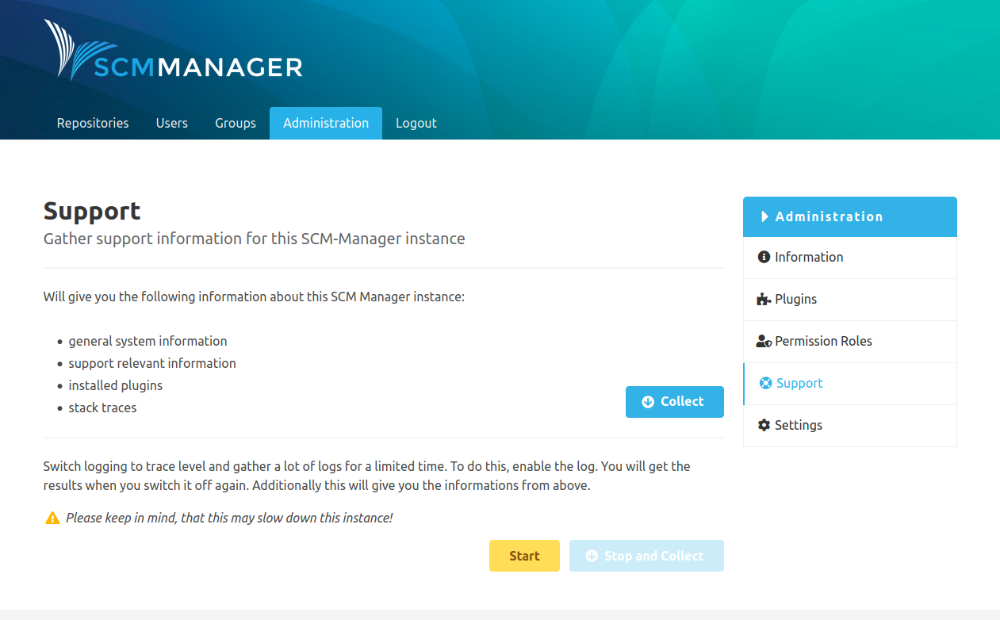

The collected information can be downloaded from the "Support" page in the administration area.

There are two options available:

The first one is a snapshot of the general system information, information relevant for support
(e.g. the configuration of SCM-Manager), a list of all installed plugins, and stack traces.
This information can be downloaded with the "Collect" button.

The second option contains an additional log with increased logging-level.
This increased logging can be started and stopped on demand and can help to get to the bottom of issues.

The recording can be started with the "Start" button.
This can slow down the instance. The results can be downloaded with the "Stop and Collect" button.
In addition to the log it also contains the information mentioned above.

All support packages created this way are available for a week after creation and are listed at the bottom of the page.
Here one can download them again or delete them manually when necessary using the delete option in the menu with the
three dots.
